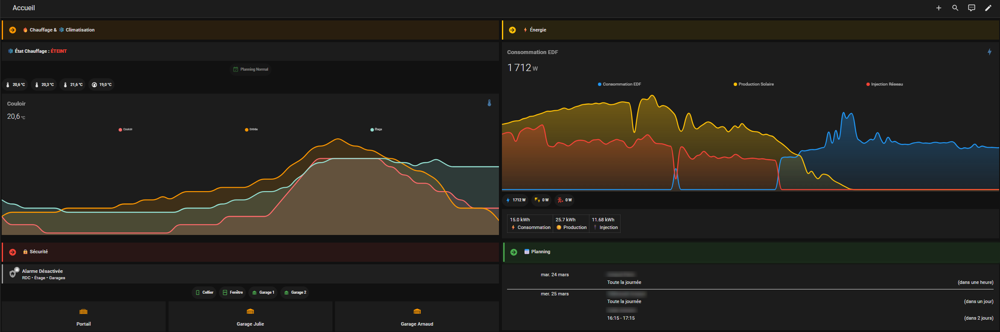
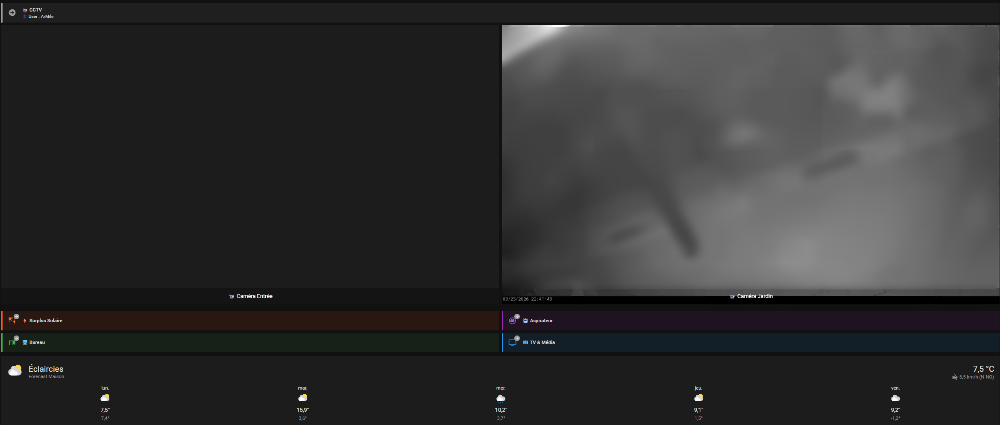

# Home Assistant - Configuration & Détails

Configuration complète de mon installation Home Assistant, organisée par fonctionnalité.

## Dashboard Accueil

Dans chaque dossier, vous retrouverez un fichier dashboard.yaml qui sera le code du dashboard

## Fonctionnalités

| # | Dossier | Description |
|---|---|---|
| 1 | [chauffage/](chauffage/) | Poêle à granulés — 8 modes de priorité, plannings dynamiques, sync vacances scolaires, syncro télétravail depuis agenda Google |
| 2 | [energie-solaire/](energie-solaire/) | Surplus solaire → Ballon eau chaude (palier 2) + Frigo américain (3 paliers), ZLinky TIC Standard |
| 3 | [ups-nas/](ups-nas/) | APC SMC1000I-2UC + NAS Synology — extinction automatique sur batterie faible |
| 4 | [infra/](infra/) | Documentation infrastructure : Quorum Proxmox, Cisco 3650, Synology |
| 5 | [tv-salon/](tv-salon/) | Disjoncteur TV OLED — coupures automatiques avec délai refroidissement, rallumages planifiés selon modes de planning chauffage |
| 6 | [bureaux/](bureaux/) | Switches Bureau Arnaud / Maxence / Julie — coupures auto, extinctions forcées, rallumages planifiés selon modes de planning chauffage |
| 7 | [robot/](robot/) | Dreame X50 Ultra Complete — lancement automatique alarme, sélection pièces ordonnée |

## Stack technique

- **Home Assistant** : HA OS, Zigbee2MQTT (coordinateur Sonoff Dongle Max Zigbee)
- **Énergie** : ZLinky TIC Standard, ECU-R (pilotage production photovoltaïque), EDF Tempo
- **Réseau** : OPNsense, Cisco Catalyst 3650-48PS, VLANs segmentés
- **Infra** : Proxmox VE Cluster 2 nœuds + Corosync sur Odroid c2 pour Quorum, Synology RS4017xs+, APC SMC1000I-2UC

## Utilisation

Chaque dossier est **autonome** : tu peux copier uniquement les fichiers qui t'intéressent.
Tu pourras retrouver des fonctionnalités dans plusieurs dossiers. Par exemple tv-salon et bureaux s'appuient sur les modes de plannings du chauffage

Chaque dossier contient :
- `helpers.yaml` — helpers HA (input_number, input_boolean, input_datetime, template sensors)
- `automations.yaml` — automations liées à cette fonctionnalité
- `scripts.yaml` — scripts si applicable
- `sensors.yaml` — sensors si applicable
- `dashboard.yaml` — Code YAML du ou des dashboard(s). Commencera toujours par dashbord_xxx.yaml
- `README.md` — documentation spécifique

## Dashboards
Utilisation des extentions HACS suivantes dans mes dashboards :
- Mushroom
- Lovelace Mini Graph Card
- Button Card by @RomRider
- Lovelace Vacuum Map card (pour mon Dreame X50)
- card-mod 4
- layout-card
- Sonos Card
- template-entity-row

## Sécurité

Le fichier `secrets.yaml` n'est **jamais** commité. Un exemple anonymisé est disponible : [`secrets.yaml.example`](secrets.yaml.example)

# ============================================================
# SOMMAIRE COMPLET DES ENTITES DECLAREES - configuration.yaml
# Toutes fonctionnalités confondues
# ============================================================
#
# ┌─────────────────────────────────────────────────────────────┐
# │ INPUT_NUMBER (26 helpers)                                   │
# ├─────────────────────────────────────────────────────────────┤
# │ Chauffage (7)                                               │
# │   temp_confort                  Température Confort         │
# │   temp_eco                      Température Éco             │
# │   temp_consigne_active          Consigne Active             │
# │   temp_vacances                 Température Vacances        │
# │   boost_duree                   Durée Boost                 │
# │   boost_temperature_supplementaire  Boost +°C               │
# │   temp_consigne_manuelle        Consigne Manuelle           │
# │                                                             │
# │ TV Salon (1)                                                │
# │   tv_salon_delai_refroidissement  Délai OLED (min)          │
# │                                                             │
# │ Ballon eau chaude (4)                                       │
# │   ballon_seuil_demarrage        Seuil Démarrage (W)         │
# │   ballon_seuil_arret            Seuil Arrêt (W)             │
# │   ballon_marge_debut            Marge après lever soleil    │
# │   ballon_marge_fin              Marge avant coucher soleil  │
# │                                                             │
# │ Frigo américain (8)                                         │
# │   frigo_seuil_demarrage         Seuil Démarrage (W)         │
# │   frigo_seuil_arret             Seuil Arrêt (W)             │
# │   frigo_power_seuil_activation  Activation Power Boost (W)  │
# │   frigo_power_seuil_arret       Arrêt Power Boost (W)       │
# │   frigo_temp_normale            Frigo Temp Normale (°C)     │
# │   congelateur_temp_normale      Congélateur Temp Normale    │
# │   frigo_temp_boost              Frigo Temp Boost (°C)       │
# │   congelateur_temp_boost        Congélateur Temp Boost      │
# │                                                             │
# │ Télétravail (2)                                             │
# │   tt_temp_debut_ts              TT Temp Début Timestamp     │
# │   tt_temp_fin_ts                TT Temp Fin Timestamp       │
# │                                                             │
# │ Robot Dreame X50 (6)                                        │
# │   robot_ordre_meeting_room      Ordre Salon                 │
# │   robot_ordre_kitchen           Ordre Cuisine               │
# │   robot_ordre_bathroom          Ordre Salle de Bain         │
# │   robot_ordre_office            Ordre Bureau                │
# │   robot_ordre_recreation_area   Ordre Entrée / Couloir      │
# │   robot_ordre_dining_hall       Ordre Salle à Manger        │
# │                                                             │
# │ UPS/NAS (1)                                                 │
# │   ups_seuil_extinction_nas      Seuil extinction NAS (min)  │
# └─────────────────────────────────────────────────────────────┘
#
# ┌─────────────────────────────────────────────────────────────┐
# │ INPUT_BOOLEAN (38 helpers)                                  │
# ├─────────────────────────────────────────────────────────────┤
# │ Chauffage (9)                                               │
# │   chauffage_actif               Chauffage ON/OFF            │
# │   chauffage_manuel              Mode Manuel                 │
# │   mode_planning_normal          Planning Normal             │
# │   mode_vacances                 Mode Vacances               │
# │   boost_temperature             Boost Température           │
# │   mode_planning_teletravail     Planning Télétravail        │
# │   mode_planning_vacances_maison Planning Vacances Maison    │
# │   mode_planning_weekend_prolonge Planning Weekend Prolongé  │
# │   chauffage_desactive_ete       Chauffage Désactivé (Été)   │
# │                                                             │
# │ Présence (1)                                                │
# │   presence_maison               Présence Maison             │
# │                                                             │
# │ Périodes horaires (8)                                       │
# │   test_periode_confort_active   Test Période Confort Active │
# │   horaires_initialises          Horaires Initialisés        │
# │   periode_normal_matin          Période Normal Matin        │
# │   periode_normal_soir           Période Normal Soir         │
# │   periode_normal_weekend        Période Normal Weekend      │
# │   periode_teletravail           Période Télétravail         │
# │   periode_vacances_maison       Période Vacances Maison     │
# │   periode_weekend_prolonge      Période Weekend Prolongé    │
# │                                                             │
# │ Sync (2)                                                    │
# │   teletravail_modification_manuelle  TT modifié manuellement│
# │   auto_sync_teletravail         Auto-sync TT                │
# │   auto_sync_vacances_scolaires  Sync vacances scolaires     │
# │                                                             │
# │ Ballon (1)                                                  │
# │   ballon_surplus_actif          Ballon sur Surplus Activé   │
# │                                                             │
# │ Frigo (1)                                                   │
# │   frigo_surplus_actif           Frigo sur Surplus Activé    │
# │                                                             │
# │ TV Salon (1)                                                │
# │   tv_salon_auto_coupure         Coupure automatique active  │
# │                                                             │
# │ Bureaux (5)                                                 │
# │   bureau_arnaud_auto_coupure    Coupure auto Arnaud         │
# │   bureau_julie_auto_coupure     Coupure auto Julie          │
# │   bureau_maxence_auto_coupure   Coupure auto Maxence        │
# │   bureau_maxence_extinction_auto_forcee  Extinction forcée  │
# │   bureau_maxence_extinction_manuelle     Extinction manuelle│
# │                                                             │
# │ Robot Dreame X50 (10)                                       │
# │   robot_auto_enable             Lancement automatique       │
# │   robot_deja_lance_aujourdhui   Déjà lancé aujourd'hui      │
# │   robot_piece_meeting_room      Pièce - Salon               │
# │   robot_piece_dining_room       Pièce - Salle à Manger      │
# │   robot_piece_bathroom          Pièce - Salle de Bain       │
# │   robot_piece_recreation_area   Pièce - Entrée / Couloir    │
# │   robot_piece_office            Pièce - Bureau              │
# │   robot_piece_kitchen           Pièce - Cuisine             │
# └─────────────────────────────────────────────────────────────┘
#
# ┌─────────────────────────────────────────────────────────────┐
# │ INPUT_DATETIME (50 helpers)                                 │
# ├─────────────────────────────────────────────────────────────┤
# │ Vacances / Boost / TT (9)                                   │
# │   vacances_debut / vacances_fin                             │
# │   boost_fin                                                 │
# │   teletravail_debut / teletravail_fin                       │
# │   vacances_maison_debut / vacances_maison_fin               │
# │   weekend_prolonge_debut / weekend_prolonge_fin             │
# │                                                             │
# │ Planning Normal semaine (12)                                │
# │   planning_normal_lun_ven_matin_debut/fin  (partagé)        │
# │   planning_normal_lundi_soir_debut/fin                      │
# │   planning_normal_mardi_soir_debut/fin                      │
# │   planning_normal_mercredi_soir_debut/fin                   │
# │   planning_normal_jeudi_soir_debut/fin                      │
# │   planning_normal_vendredi_soir_debut/fin                   │
# │                                                             │
# │ Planning Normal weekend (4)                                 │
# │   planning_normal_samedi_debut/fin                          │
# │   planning_normal_dimanche_debut/fin                        │
# │                                                             │
# │ Planning Télétravail 7j (14)                                │
# │   planning_teletravail_lundi_debut/fin                      │
# │   planning_teletravail_mardi_debut/fin                      │
# │   planning_teletravail_mercredi_debut/fin                   │
# │   planning_teletravail_jeudi_debut/fin                      │
# │   planning_teletravail_vendredi_debut/fin                   │
# │   planning_teletravail_samedi_debut/fin                     │
# │   planning_teletravail_dimanche_debut/fin                   │
# │                                                             │
# │ Planning Vacances Maison (2)                                │
# │   planning_vacances_maison_debut/fin                        │
# │                                                             │
# │ Planning Weekend Prolongé (2)                               │
# │   planning_weekend_prolonge_debut/fin                       │
# │                                                             │
# │ Ballon eau chaude (2)                                       │
# │   ballon_heure_debut / ballon_heure_fin                     │
# │                                                             │
# │ TV Salon (6)                                                │
# │   tv_salon_last_on / tv_salon_last_off                      │
# │   tv_salon_last_disjoncteur_tv_off                          │
# │   tv_salon_heure_limite_semaine / _weekend                  │
# │   tv_salon_rallumage_matin                                  │
# │                                                             │
# │ Bureau Arnaud (6)                                           │
# │   bureau_arnaud_last_on / last_off / last_switch_off        │
# │   bureau_arnaud_heure_limite_semaine / _weekend             │
# │   bureau_arnaud_rallumage_matin                             │
# │                                                             │
# │ Bureau Maxence (8)                                          │
# │   bureau_maxence_last_on / last_off / last_switch_off       │
# │   bureau_maxence_heure_limite_semaine / _weekend            │
# │   bureau_maxence_rallumage_matin                            │
# │   bureau_maxence_extinction_forcee_ecole / _weekend         │
# │                                                             │
# │ Bureau Julie (6)                                            │
# │   bureau_julie_last_on / last_off / last_switch_off         │
# │   bureau_julie_heure_limite_semaine / _weekend              │
# │   bureau_julie_rallumage_matin                              │
# │                                                             │
# │ Robot Dreame X50 (2)                                        │
# │   robot_heure_debut / robot_heure_fin                       │
# └─────────────────────────────────────────────────────────────┘
#
# ┌─────────────────────────────────────────────────────────────┐
# │ TEMPLATE SENSORS (9 sensors + 4 binary_sensors)             │
# ├─────────────────────────────────────────────────────────────┤
# │   temperature_rdc_corrigee      Temp RDC corrigée (-0.5°C)  │
# │   zlinky_papp_power             ZLinky SINSTS VA → W        │
# │   puissance_surplus_solaire     ZLinky SINSTI VA → W        │
# │   production_solaire_filtree    ECU current power filtré    │
# │   smc1000i_autonomie_minutes    APC UPS autonomie (min)     │
# │   heure_lever_soleil            Prochain lever (HH:MM)      │
# │   heure_coucher_soleil          Prochain coucher (HH:MM)    │
# │   prochain_bloc_teletravail     Bloc TT avec attributs      │
# │   robot_segments_selectionnes   IDs pièces ordonnés         │
# │   consommation_journaliere_totale  Somme 6 index Tempo kWh  │
# │                                                             │
# │   [binary] tv_salon_reellement_on       seuil > 50W         │
# │   [binary] bureau_arnaud_reellement_on  seuil > 30W         │
# │   [binary] bureau_maxence_reellement_on seuil > 30W         │
# │   [binary] bureau_julie_reellement_on   seuil > 30W         │
# └─────────────────────────────────────────────────────────────┘
#
# ┌─────────────────────────────────────────────────────────────┐
# │ INPUT_SELECT (4)                                            │
# ├─────────────────────────────────────────────────────────────┤
# │   selecteur_planning_config     Normal/TT/VacMaison/WE+     │
# │   ballon_statut                 Arrêté/Chauffe/Attente/Forcé│
# │   frigo_statut                  Normal/Boost/BoostMax/Attente│
# │   robot_mode_nettoyage          Complet / Pièces sélect.    │
# └─────────────────────────────────────────────────────────────┘
#
# ┌─────────────────────────────────────────────────────────────┐
# │ UTILITY_METER (22 compteurs)                                │
# ├─────────────────────────────────────────────────────────────┤
# │ TV Salon (4)   journalier / hebdo / mensuel / annuel        │
# │ EDF Tempo (6)  HC bleu/blanc/rouge + HP bleu/blanc/rouge    │
# │ Bureau Arnaud (4)  journalier / hebdo / mensuel / annuel    │
# │ Bureau Maxence (4) journalier / hebdo / mensuel / annuel    │
# │ Bureau Julie (4)   journalier / hebdo / mensuel / annuel    │
# │ Injection (1)  injection_journaliere                        │
# └─────────────────────────────────────────────────────────────┘
#
# ┌─────────────────────────────────────────────────────────────┐
# │ RECAPITULATIF GLOBAL                                        │
# ├─────────────────────────────────────────────────────────────┤
# │   input_number    :  26 helpers                             │
# │   input_boolean   :  38 helpers                             │
# │   input_datetime  :  50 helpers                             │
# │   input_select    :   4 helpers                             │
# │   template sensor :  10 sensors  +  4 binary_sensors        │
# │   utility_meter   :  22 compteurs                           │
# │   command_line    :   1 sensor (Proxmox Quorum)             │
# │   device_tracker  :   1 (Cisco 3650 SSH)                    │
# │                                                             │
# │   TOTAL HELPERS   : 118 entités déclarées                   │
# └─────────────────────────────────────────────────────────────┘

# ============================================================
# SOMMAIRE COMPLET DES AUTOMATIONS DÉCLARÉES - automations.yaml
# Toutes fonctionnalités confondues
# ============================================================
#
# ┌─────────────────────────────────────────────────────────────┐
# │ 0. SYSTÈME (1 automation)                                   │
# ├─────────────────────────────────────────────────────────────┤
# │   0.1  Reboot_HA                    Reboot quotidien 05:04  │
# └─────────────────────────────────────────────────────────────┘
#
# ┌─────────────────────────────────────────────────────────────┐
# │ 1. CHAUFFAGE - INITIALISATION & CALCUL (2)                  │
# ├─────────────────────────────────────────────────────────────┤
# │   1.1  Phase 1 - Init Horaires      1 seul démarrage        │
# │   1.2  Chauffage - Calcul Consigne  Priorités 1→8           │
# └─────────────────────────────────────────────────────────────┘
#
# ┌─────────────────────────────────────────────────────────────┐
# │ 2. CHAUFFAGE - RÉGULATION (2)                               │
# ├─────────────────────────────────────────────────────────────┤
# │   2.1  Chauffage - Allumer          Seuil consigne -0.3°C   │
# │   2.2  Chauffage - Éteindre         Seuil consigne +0.5°C   │
# └─────────────────────────────────────────────────────────────┘
#
# ┌─────────────────────────────────────────────────────────────┐
# │ 3. MODE VACANCES ABSENCE - PRIORITÉ 1 (3)                   │
# ├─────────────────────────────────────────────────────────────┤
# │   3.1  Planning - Vacances Auto     Activation/désact. auto │
# │   3.2  Vacances - Appliquer Temp    Applique temp_vacances  │
# │   3.4  Vacances - Retour Planning   Retour au planning auto │
# └─────────────────────────────────────────────────────────────┘
#
# ┌─────────────────────────────────────────────────────────────┐
# │ 4. BOOST TEMPÉRATURE (5)                                    │
# ├─────────────────────────────────────────────────────────────┤
# │   4.1  Boost - Activation           Calcul heure de fin     │
# │   4.2  Boost - Désactivation Auto   À expiration boost_fin  │
# │   4.3  Chauffage - Retour Auto      Désact. manuel au chgt  │
# │   4.4  Manuel - Bloquer Vacances    Bloque si mode vacances │
# │   4.5  Vacances - Bloquer Boost     Bloque boost si absent  │
# └─────────────────────────────────────────────────────────────┘
#
# ┌─────────────────────────────────────────────────────────────┐
# │ 5. SYNCHRONISATION ÉTAT CHAUFFAGE (1)                       │
# ├─────────────────────────────────────────────────────────────┤
# │   5.1  Chauffage - Sync État Réel   Sync contacteur → bool  │
# └─────────────────────────────────────────────────────────────┘
#
# ┌─────────────────────────────────────────────────────────────┐
# │ 6. MODE ÉTÉ (3)                                             │
# ├─────────────────────────────────────────────────────────────┤
# │   6.1  Été - Bloquer Activation     Bloque si mode été ON   │
# │   6.2  Été - Notification Activ.    Email mode été activé   │
# │   6.3  Été - Notification Désact.   Email mode été désactivé│
# └─────────────────────────────────────────────────────────────┘
#
# ┌─────────────────────────────────────────────────────────────┐
# │ 7. MODES DE PLANNING AVEC DATES (5)                         │
# ├─────────────────────────────────────────────────────────────┤
# │   7.1  Planning - Télétravail Auto  Priorité 4              │
# │   7.2  Planning - Vacances Maison   Priorité 5              │
# │   7.3  Planning - Weekend Prolongé  Priorité 6              │
# │   7.4  Planning - Bloquer Vacances  Désact. si absent       │
# │   7.5  Planning - Exclusion Mutuel  1 seul mode à la fois   │
# └─────────────────────────────────────────────────────────────┘
#
# ┌─────────────────────────────────────────────────────────────┐
# │ 8. PROTECTION & NETTOYAGE (4)                               │
# ├─────────────────────────────────────────────────────────────┤
# │   8.1  Protection - Vérif. dates    Désact. si hors plage   │
# │   8.2  Protection - Anti-boucle     Délai 30s notif. chauf. │
# │   9.1  Nettoyage Périodes           Désact. périodes orphel.│
# │   9.2  Sync État Mode Normal        Mode normal si tout OFF │
# └─────────────────────────────────────────────────────────────┘
#
# ┌─────────────────────────────────────────────────────────────┐
# │ 9. SYNC VACANCES SCOLAIRES (3)                              │
# ├─────────────────────────────────────────────────────────────┤
# │   9.3  Auto sync vacances maison    Depuis calendrier Zone B│
# │   9.4  Clear après période (binaire)Synchro prochaines vac. │
# │   9.5  Clear après période (23:00)  Efface dates expirées   │
# └─────────────────────────────────────────────────────────────┘
#
# ┌─────────────────────────────────────────────────────────────┐
# │ 10. HORAIRES DYNAMIQUES PHASE 2 (7)                         │
# ├─────────────────────────────────────────────────────────────┤
# │   10.1 Normal Matin                 Lun-Ven (partagé)       │
# │   10.2 Normal Soir Lun-Mar-Jeu-Ven  4 jours distincts       │
# │   10.3 Normal Mercredi Soir         Horaire spécial mercredi│
# │   10.4 Normal Weekend               Sam-Dim                 │
# │   10.5 Télétravail                  7j/7 horaires par jour  │
# │   10.6 Vacances Maison              7j/7 horaire unique     │
# │   10.7 Weekend Prolongé             7j/7 horaire unique     │
# └─────────────────────────────────────────────────────────────┘
#
# ┌─────────────────────────────────────────────────────────────┐
# │ 11. BALLON EAU CHAUDE (5)                                   │
# ├─────────────────────────────────────────────────────────────┤
# │   11.1 MAJ heures selon soleil      Lever/coucher + marges  │
# │   11.2 Démarrage sur surplus        Seuil démarrage (W)     │
# │   11.3 Arrêt surplus insuffisant    Seuil arrêt (W) 5min    │
# │   11.4 Arrêt coucher du soleil      Sunset → OFF            │
# │   11.5 Synchronisation statut       Contacteur → input_sel  │
# └─────────────────────────────────────────────────────────────┘
#
# ┌─────────────────────────────────────────────────────────────┐
# │ 12. FRIGO AMÉRICAIN - 3 PALIERS (7)                         │
# ├─────────────────────────────────────────────────────────────┤
# │   12.1 Activation boost temp (v1)   Palier 1 - 1ère version │
# │   12.2 Activation boost temp (v2)   Palier 1 - version act. │
# │   12.3 Activation Power Boost       Palier 3 (ballon ON)    │
# │   12.4 Désactivation Power Boost    Surplus < seuil arrêt   │
# │   12.5 Désact. PB si ballon arrêté  Cascade arrêt           │
# │   12.6 Désactivation complète       Retour temp. normales   │
# │   12.7 Arrêt boost coucher soleil   Sunset → tout normal    │
# └─────────────────────────────────────────────────────────────┘
#
# ┌─────────────────────────────────────────────────────────────┐
# │ 13. TV SALON (16)                                           │
# ├─────────────────────────────────────────────────────────────┤
# │ Traces (3)                                                  │
# │   13.1 Trace allumage TV            > 50W / 10s             │
# │   13.2 Trace extinction TV          < 10W / 10s             │
# │   13.3 Trace coupure disjoncteur    State OFF → ON          │
# │ Coupures automatiques (2)                                   │
# │   13.4 Coupure auto (limite/refroid)Toutes les 5 min        │
# │   13.5 Coupure départ Vacances      Immédiate + email       │
# │ Rallumages (9)                                              │
# │   13.6 Rallumage matinal            Heure configurée        │
# │   13.7 Rallumage soir lundi         Heure planning normal   │
# │   13.8 Rallumage soir mardi         "                       │
# │   13.9 Rallumage soir mercredi      "                       │
# │   13.10 Rallumage soir jeudi        "                       │
# │   13.11 Rallumage soir vendredi     "                       │
# │   13.12 Rallumage chgmt mode        Vers TT/VacMaison/WE+   │
# │   13.13 Coupure chgmt Planning Nrml Attente refroid. OLED   │
# │   13.14 Vérif. quotidienne Vacances 02:00 si disjonct. ON   │
# │   13.15 Rallumage retour Vacances   Mode vacances → OFF     │
# │ Notifications (1)                                           │
# │   13.16 Notification disjoncteur    Email ON/OFF avec stats │
# └─────────────────────────────────────────────────────────────┘
#
# ┌─────────────────────────────────────────────────────────────┐
# │ 14. BUREAU ARNAUD (14)                                      │
# ├─────────────────────────────────────────────────────────────┤
# │ Traces (3)    14.1 allumage  14.2 extinction  14.3 switch   │
# │ Coupures (2)  14.4 auto (30min après ext.)  14.13 vacances  │
# │ Rallumages (8)                                              │
# │   14.5 weekend Mode Normal   14.6 autres modes (7j)         │
# │   14.7→14.11 soir lun→ven (Mode Normal)                     │
# │   14.12 changement mode TT/VacMaison/WE+                    │
# │ Notifications (1)   14.14 email ON/OFF avec stats           │
# └─────────────────────────────────────────────────────────────┘
#
# ┌─────────────────────────────────────────────────────────────┐
# │ 15. BUREAU MAXENCE (15)                                     │
# ├─────────────────────────────────────────────────────────────┤
# │ Traces (3)    15.1 allumage  15.2 extinction  15.3 switch   │
# │ Coupures (3)  15.4 auto (30min)  15.5 forcée  15.6 manuelle │
# │ Rallumages (8)                                              │
# │   15.7 weekend Mode Normal   15.8 autres modes (7j)         │
# │   15.9→15.13 soir lun→ven (Mode Normal)                     │
# │   15.14 changement mode TT/VacMaison/WE+                    │
# │ Notifications (1)   15.15 email ON/OFF avec stats           │
# └─────────────────────────────────────────────────────────────┘
#
# ┌─────────────────────────────────────────────────────────────┐
# │ 16. BUREAU JULIE (13)                                       │
# ├─────────────────────────────────────────────────────────────┤
# │ Traces (3)    16.1 allumage  16.2 extinction  16.3 switch   │
# │ Coupures (1)  16.4 auto (30min après ext.)                  │
# │ Rallumages (8)                                              │
# │   16.5 weekend Mode Normal   16.6 autres modes (7j)         │
# │   16.7→16.11 soir lun→ven (Mode Normal)                     │
# │   16.12 changement mode TT/VacMaison/WE+                    │
# │ Notifications (1)   16.13 email ON/OFF avec stats           │
# └─────────────────────────────────────────────────────────────┘
#
# ┌─────────────────────────────────────────────────────────────┐
# │ 17. PLANNING TÉLÉTRAVAIL - SYNC CALENDRIER (3)              │
# ├─────────────────────────────────────────────────────────────┤
# │   17.1 Vérification périodique      Toutes les heures       │
# │   17.2 Reset lundi matin            00:15 + sync auto       │
# │   17.3 Détection modif. manuelle    Désact. auto-sync       │
# └─────────────────────────────────────────────────────────────┘
#
# ┌─────────────────────────────────────────────────────────────┐
# │ 18. ROBOT DREAME X50 (2)                                    │
# ├─────────────────────────────────────────────────────────────┤
# │   18.1 Lancer robot (alarme + hors rouge)  15min après arm  │
# │   18.2 Réinitialiser compteur              Minuit quotidien │
# └─────────────────────────────────────────────────────────────┘
#
# ┌─────────────────────────────────────────────────────────────┐
# │ 19. UPS / NAS (1)                                           │
# ├─────────────────────────────────────────────────────────────┤
# │   19.1 Extinction NAS sur batterie  Seuil autonomie (min)   │
# └─────────────────────────────────────────────────────────────┘
#
# ┌─────────────────────────────────────────────────────────────┐
# │ RÉCAPITULATIF GLOBAL                                        │
# ├─────────────────────────────────────────────────────────────┤
# │  0. Système              :   1 automation                   │
# │  1. Chauffage Init/Calcul:   2 automations                  │
# │  2. Chauffage Régulation :   2 automations                  │
# │  3. Mode Vacances        :   3 automations                  │
# │  4. Boost Température    :   5 automations                  │
# │  5. Sync État            :   1 automation                   │
# │  6. Mode Été             :   3 automations                  │
# │  7. Modes Planning       :   5 automations                  │
# │  8. Protection/Nettoyage :   4 automations                  │
# │  9. Sync Vacances Scol.  :   3 automations                  │
# │ 10. Horaires Phase 2     :   7 automations                  │
# │ 11. Ballon Eau Chaude    :   5 automations                  │
# │ 12. Frigo 3 Paliers      :   7 automations                  │
# │ 13. TV Salon             :  16 automations                  │
# │ 14. Bureau Arnaud        :  14 automations                  │
# │ 15. Bureau Maxence       :  15 automations                  │
# │ 16. Bureau Julie         :  13 automations                  │
# │ 17. Planning TT Calendr. :   3 automations                  │
# │ 18. Robot Dreame X50     :   2 automations                  │
# │ 19. UPS / NAS            :   1 automation                   │
# │                                                             │
# │  TOTAL                   : 112 automations                  │
# └─────────────────────────────────────────────────────────────┘
# ============================================================