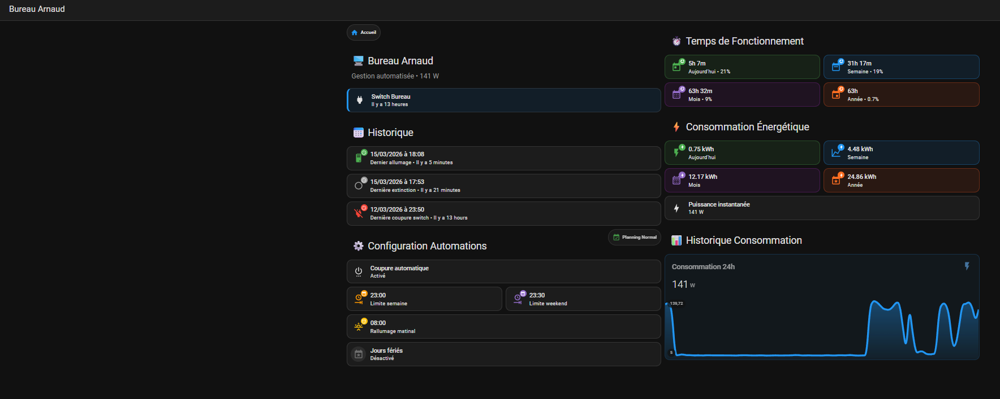
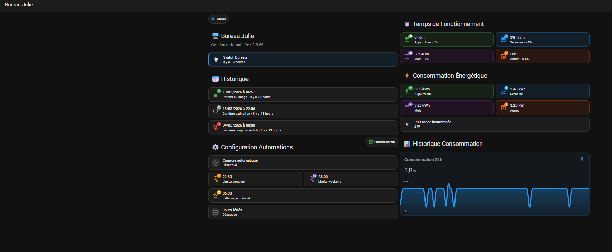
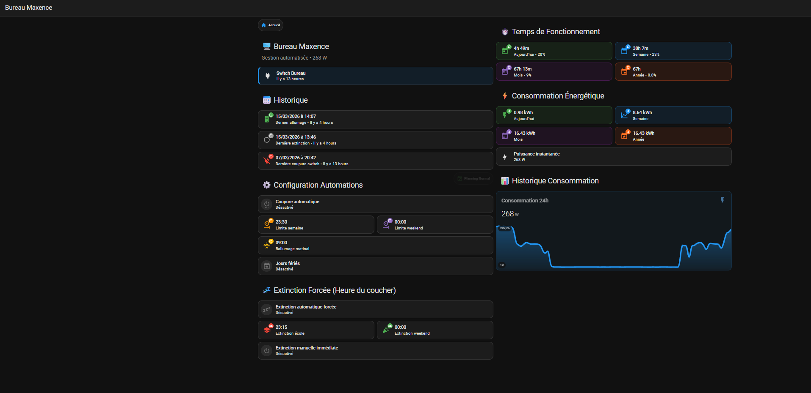

# Bureaux

Gestion de la coupure/allumage des bureaux selon les modes de plannings (chauffage) actifs
Calcul des temps de fonctionnement et consommations énergétiques.

## Dashboards Bureaux

## Utilisation

Les dashboards "Bureau Arnaud", "Bureau Julie" et "Bureau Maxence" s'appuient sur les modes de plannings du chauffage

Le dossier contient :
- `helpers.yaml` — helpers HA (input_number, input_boolean, input_datetime, template sensors)
- `automations.yaml` — automations liées à cette fonctionnalité
- `automations_planning_tt.yaml` — automations liées à à la récupération des évènements Télétravail dans l'agenda Google
- `sensors.yaml` — sensors
- `dashboard_bureau_Arnaud.yaml` — Code YAML du dashboard Bureau Arnaud
- `dashboard_bureau_Julie.yaml` — Code YAML du dashboard Bureau Julie
- `dashboard_bureau_Maxence.yaml` — Code YAML du dashboard Bureau Maxence
- `README.md` — documentation spécifique

## Dashboards
Utilisation des extentions HACS suivantes dans mes dashboards :
- Mushroom
- Lovelace Mini Graph Card
- Button Card by @RomRider
- card-mod 4
- layout-card
- Sonos Card
- template-entity-row