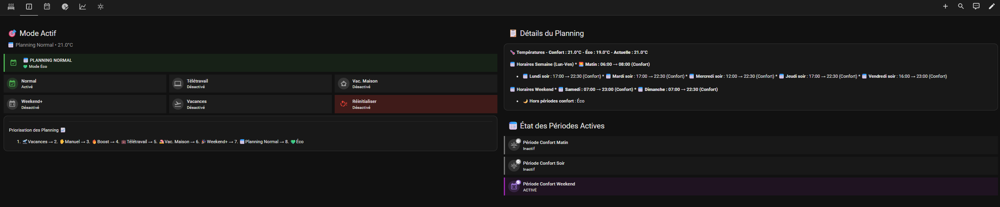
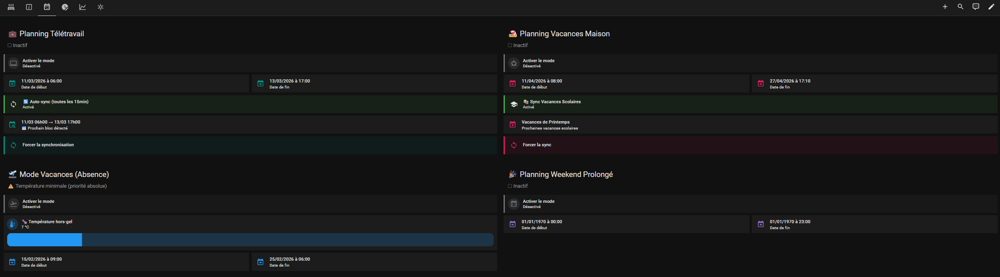
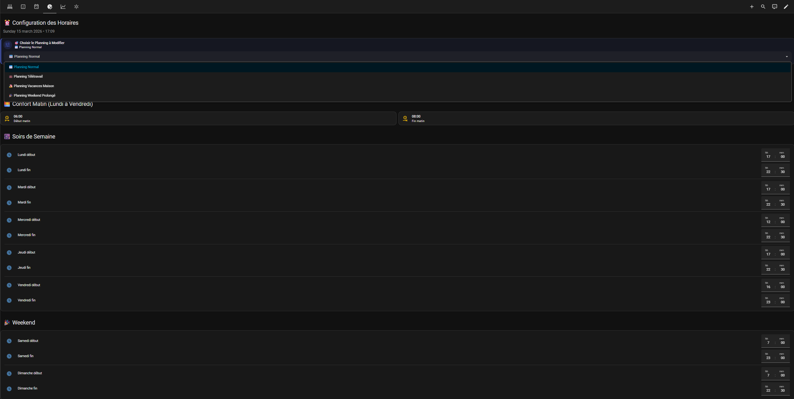

# Chauffage

Gestion de mon poêle à granulés.
Je n'ai que cette source de chauffage dans la maison mais peut facilement s'adapter pour piloter chaque chauffage individuellement. Projet de s'appuyer sur ce modèle pour piloter ma climatisation pour chaque pièce de la maison.

Le dashboard est optimisé pour une tablette 8/10 pouces en mode paysage. Mais l'affichage est très lisible sur un smartphone tout comme sur un grand écran

Pluieurs vues dans le tableau pour allèger la navigation :
- Chauffage
- Etat Planning
- Paramétrage Planning : Configuration des dates début/Fin de chaque mode 1. 🛫Vacances → 2. ✋Manuel → 3. 🔥Boost → 4. 💼Télétravail → 5. 🏖️Vac. Maison → 6. 🎉Weekend+ → 7. 📅Planning Normal → 8. 💚Éco. Mode Manuel et Mode Boost disponible. Synchrionisation (ou pas) des dates de vacances Scolaire pour parmamétrage auto du mode. Synchrionisation (ou pas) des Télétravails paramétrés dans le caldendrier Google avec Gestion de "blocs" pour parmamétrage auto du mode. 
- Configuration des horaires pour chaque mode de planning (Normal / Vacances à la maison / Télétravail / Weekend Prolongé)
- Historique pour voir quand le chauffage se déclenche et les températures mesurées et de consigne sur 24H

## Dashboard Chauffage

Le dossier contient :
- `helpers.yaml` — helpers HA (input_number, input_boolean, input_datetime, template sensors)
- `automations.yaml` — automations liées à cette fonctionnalité
- `scripts.yaml` — scripts
- `dashboard.yaml` — Code YAML du dashboard 
- `README.md` — documentation spécifique

## Dashboards
Utilisation des extentions HACS suivantes dans mes dashboards :
- Mushroom
- Lovelace Mini Graph Card
- Button Card by @RomRider
- card-mod 4
- layout-card
- template-entity-row

