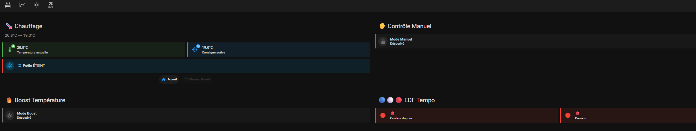
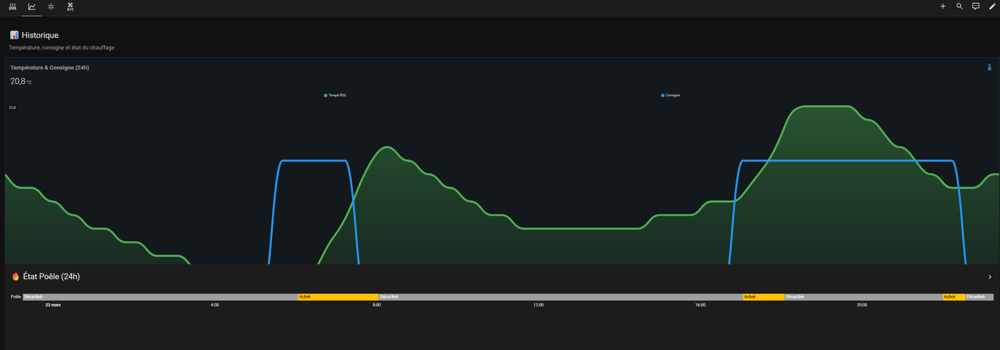
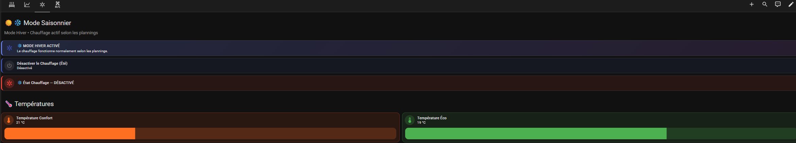
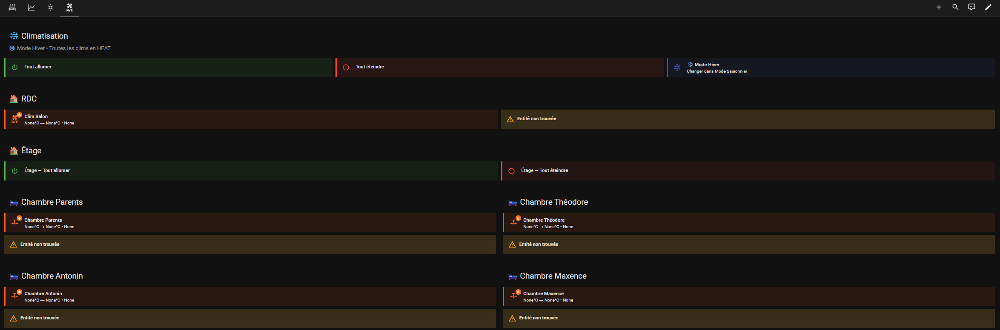

# Chauffage

Gestion de mon poêle à granulés.
Je n'ai que cette source de chauffage dans la maison mais peut facilement s'adapter pour piloter chaque chauffage individuellement. Projet de s'appuyer sur ce modèle pour piloter ma climatisation pour chaque pièce de la maison.

Le dashboard est optimisé pour une tablette 8/10 pouces en mode paysage. Mais l'affichage est très lisible sur un smartphone tout comme sur un grand écran

Pluieurs vues dans le tableau pour allèger la navigation :
- Chauffage
- Historique pour voir quand le chauffage se déclenche et les températures mesurées et de consigne sur 24H.
- Mode Saisonnier pour désactiver contact Sec du Poêle à granulés et basculer les climatisations en mode Clim été / Chauffage Hiver
- Climatisation : Préparation du pilotage des climatisation individuellement par pièce (en contruction)

## Dashboard Chauffage

Le dossier contient :
- `helpers.yaml` — helpers HA (input_number, input_boolean, input_datetime, template sensors)
- `automations.yaml` — automations liées à cette fonctionnalité
- `scripts.yaml` — scripts
- `dashboard.yaml` — Code YAML du dashboard 
- `README.md` — documentation spécifique

## Dashboards
Utilisation des extentions HACS suivantes dans mes dashboards :
- Mushroom
- Lovelace Mini Graph Card
- Button Card by @RomRider
- card-mod 4
- layout-card
- template-entity-row

