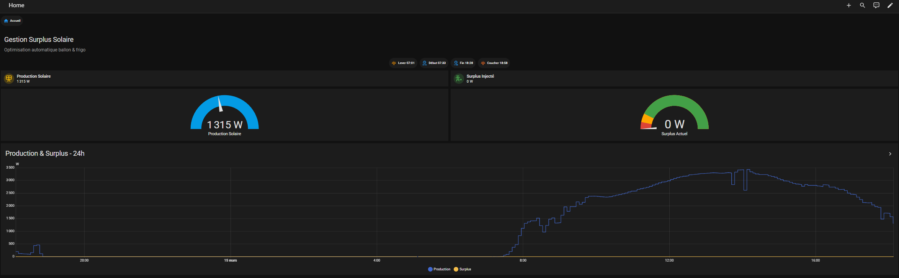
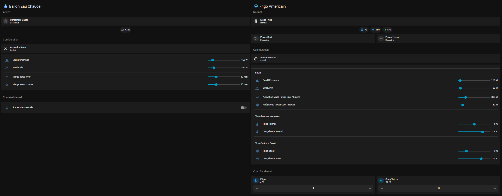

# Energie Solaire

Gestion du Surplus Solaire pour Autoconsommation plutôt qu'injection sur réseau ENEDIS.
Ballon d'eau Chaude et Frigo Américain pilotés pour consommer le surplus de production Solaire plutôt que l'injecter vers le réseau.

Prise en compte dynamique des heures de lever et coucher du soleil.
Mesures de la productioin solaire et injection du surplus vers le réseau.

Palier 1 : Baisse des températures Frigo et congélateur.
Palier 2 : Démarrage cycle de chauffe du ballon d'eau chaude.
Palier 3 : Activation des modes "Power Cool (Frigo à 0°C)" et "Power Freeze (ongélateur à -23°C)".

## Dashboards Bureaux

Le dossier contient :
- `helpers.yaml` — helpers HA (input_number, input_boolean, input_datetime, template sensors)
- `automations.yaml` — automations liées à cette fonctionnalité
- `sensors.yaml` — sensors
- `dashboard.yaml` — Code YAML du dashboard Bureau Arnaud
- `README.md` — documentation spécifique

## Dashboards
Utilisation des extentions HACS suivantes dans mes dashboards :
- Mushroom
- Lovelace Mini Graph Card
- Button Card by @RomRider
- card-mod 4
- layout-card
- Sonos Card
- template-entity-row