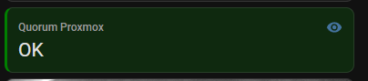

# Infrastructures

Permet de savoir quel est l'état du Quorum pour le cluster Proxmox
- OK : 3 votants
- DEGRADED : 2 votants. On a perdu un noeud Proxmox ou QNetd sur Odroid C2
- CRITICAL : 1 seul votant. Le Quorum n'est plus assuré. Défaillance infra

Le dossier contient :
- `helpers.yaml` — helpers HA (input_number, input_boolean, input_datetime, template sensors) : remplacé par cisco.md et proxmox.md pour documentation/configuration
- `dashboard.yaml` — Code YAML du dashboard 
- `README.md` — documentation spécifique

## Dashboards
Utilisation des extentions HACS suivantes dans mes dashboards :
- Mushroom
- Lovelace Mini Graph Card
- Button Card by @RomRider
- card-mod 4
- layout-card
- template-entity-row