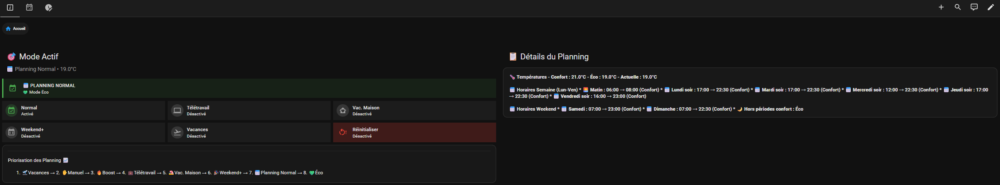
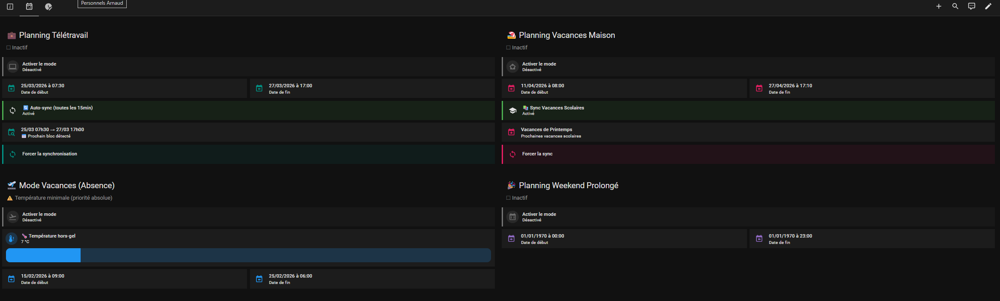
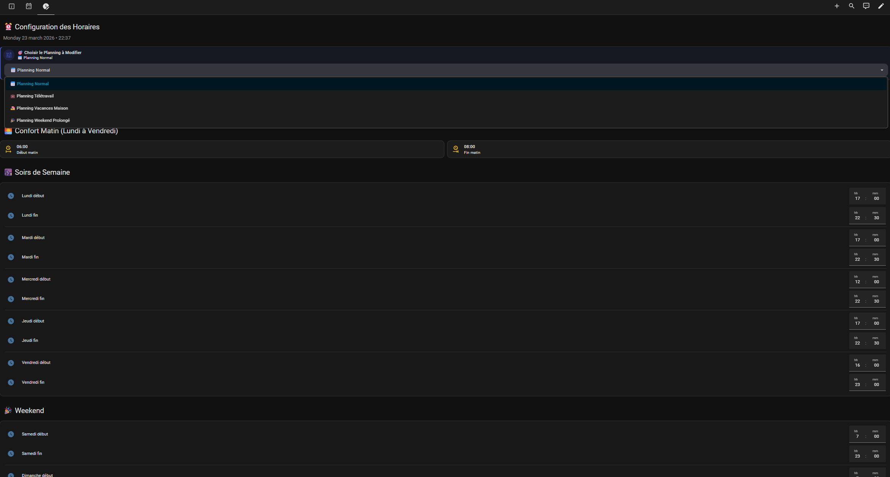

# Gestion des Modes de Planning

Gestion des différents modes de Planning.
Détachement de la gestion du chauffage car utilisés sur plusieurs de mes automations

## Dashboards Modes Planning

Le dossier contient :
- `helpers.yaml` — helpers HA (input_number, input_boolean, input_datetime, template sensors)
- `automations.yaml` — automations liées à cette fonctionnalité
- `sensors.yaml` — sensors
- `dashboard.yaml` — Code YAML du dashboard Bureau Arnaud
- `README.md` — documentation spécifique

## Dashboards
Utilisation des extentions HACS suivantes dans mes dashboards :
- Mushroom
- Lovelace Mini Graph Card
- Button Card by @RomRider
- card-mod 4
- layout-card
- template-entity-row