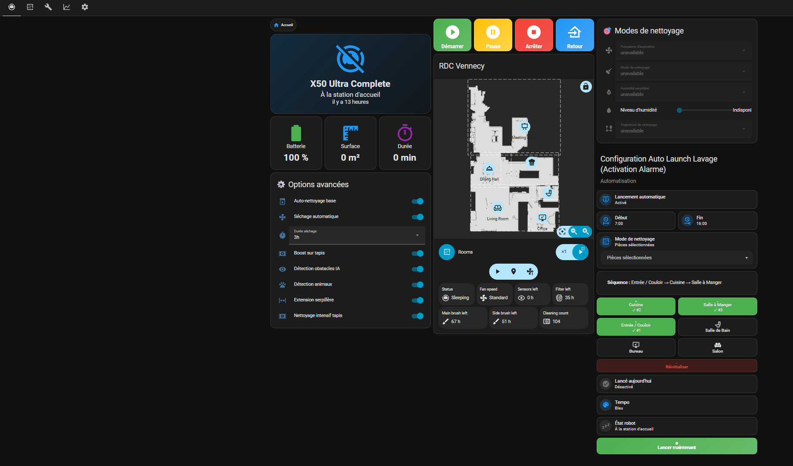
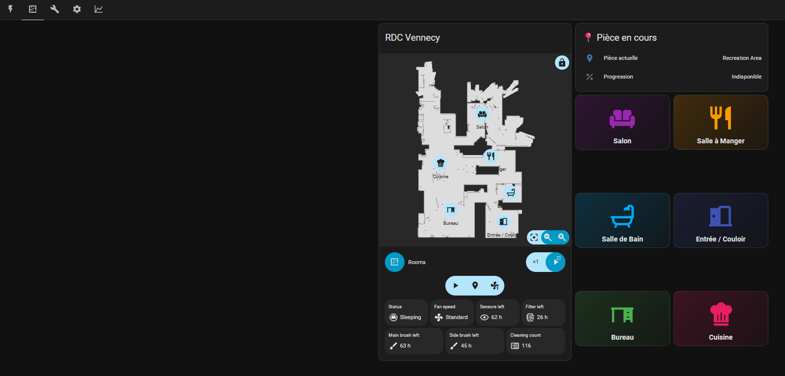
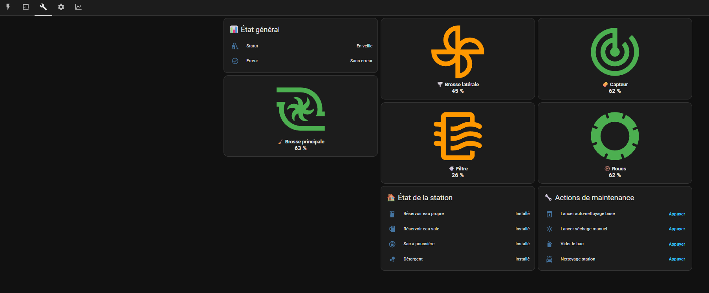
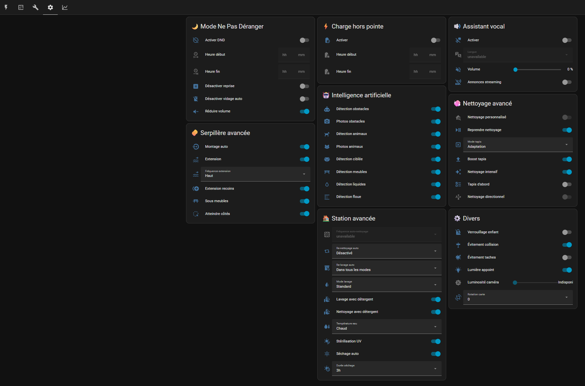
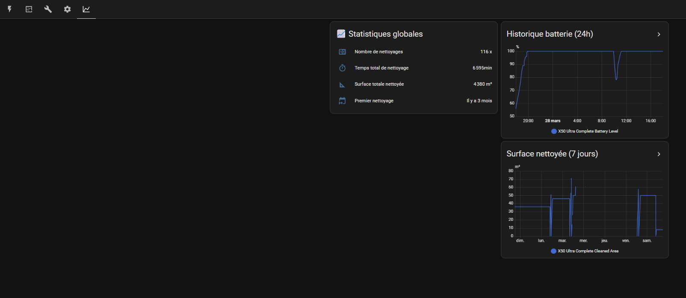

# Robot Dreame X50

Pilotage du Robot via extention HACS "Dreame vacuum integration for Home Assistant"

/!\ ATTENTION /!\ : Utilisez la version Beta (v2.0.0B22 au 28/03/2026)

Permet de gérer quasi tous les paramètres comme depuis application.

Activation auto quand alarme activée depuis 15mn ou manuelle. Choix du nettoyage complet ou selon les pièces sélectionnées et dans l'ordre de sélection

Dernières modifications : aspiration seule / Apsiration puis lavage / Aspiration ET lavage / etc... / Mode Auto (CleanGenius) ou Personnalisé (Manuel)

Le dossier contient :
- `helpers.yaml` — helpers HA (input_number, input_boolean, input_datetime, template sensors)
- `automations.yaml` — automations liées à cette fonctionnalité
- `dashboard.yaml` — Code YAML du dashboard 
- `scripts.yaml` — scripts
- `fr.json` — Fichier de traduction Dreame modifié (/config/custom_components/dreame_vacuum/translations/fr.json)
- `README.md` — documentation spécifique

## Dashboards
Utilisation des extentions HACS suivantes dans mes dashboards :
- Mushroom
- Lovelace Mini Graph Card
- Button Card by @RomRider
- Lovelace Vacuum Map card (pour mon Dreame X50)
- card-mod 4
- layout-card
- template-entity-row