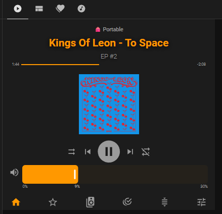
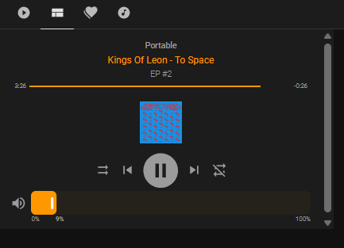
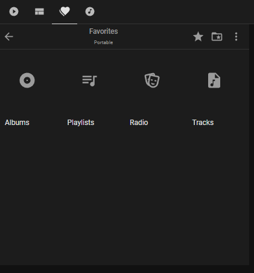
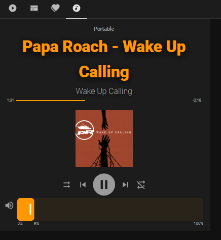

# SONOS

Gestion de mon SONOS.

S'appuie sur l'intégration Sonos
Attention, besoin de déclarer dans configuration.yaml les IP de vos enceintes Sonos si HA est dans un VLan différent

## Dashboards Sonos

## Utilisation

Les dashboards dans différentes vues.

Pas encore abouti et en construction. Interface ne me convient pas encore. Mais je la mets à dispo quand même

Le dossier contient :
- `helpers.yaml` — helpers HA (input_number, input_boolean, input_datetime, template sensors)
- `dashboard.yaml` — Code YAML du dashboard Bureau Arnaud
- `README.md` — documentation spécifique

## Dashboards
Utilisation des extentions HACS suivantes dans mes dashboards :
- Mushroom
- Lovelace Mini Graph Card
- Button Card by @RomRider
- card-mod 4
- layout-card
- Sonos Card
- template-entity-row