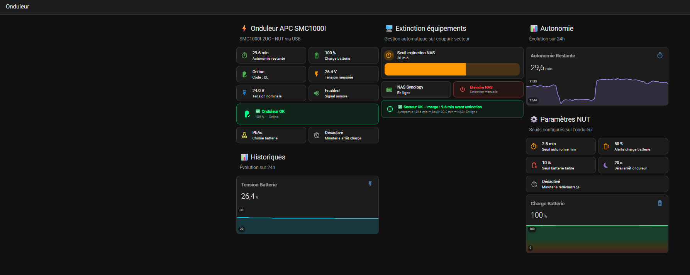

# UPS / NAS

Visualisation des informations de l'onduleur APC via Application "Network UPS Tools" et intégration "NUT"
Connexion USB de l'onduleur directement attaché à la VM HA via Proxmox. Fonctionne de la même manière si votre HA n'est pas virtualisé (PC/Raspberry/etc...)

Gestion du seuil d'extinction (en minutes) selon. Extinction propre de mon NAS si seuil atteint pour aussi préserver l'autonomie à mon Infra qui est ondulée

Le dossier contient :
- `helpers.yaml` — helpers HA (input_number, input_boolean, input_datetime, template sensors)
- `automations.yaml` — automations liées à cette fonctionnalité
- `dashboard.yaml` — Code YAML du dashboard 
- `README.md` — documentation spécifique

## Dashboards
Utilisation des extentions HACS suivantes dans mes dashboards :
- Mushroom
- Lovelace Mini Graph Card
- Button Card by @RomRider
- card-mod 4
- layout-card
- template-entity-row